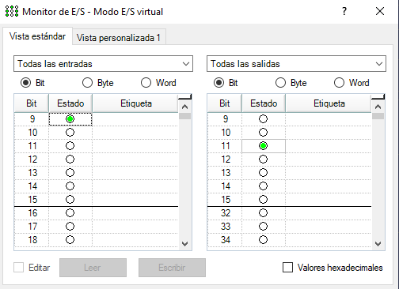

# Lab2_Robotica_Tovar
***Se realizó de manera individual tanto las simulaciones, como el programa en el software de EPSON como las pruebas experimentales por lo que se entrega individuamente***.

## Índice
## Índice
1. [Contenido del Repositorio](#contenido-repositorio)
2. [Solución](#solución)

## Contenido repositorio
 - El archivo comprimido _Lab2_VT6.rar_ contiene los archivos correspondientes del software EPSON RC+ 7.0.
 - El archivo _Main.prg_ es el programa principal que se desarrollo en el lenguaje SPEL para la solución.
 - El pdf _Guia Practica EPSON RC + 7.0 - Básica VT6L.pdf_ contiene el enunciado dado por la empresa CDM.
 - La carpeta _media_ contiene las imágenes de este documento y otras.

## Solución
Este laboratorio se desarrollo con base a la guía _Guia Practica EPSON RC + 7.0 - Básica VT6L_, se divide principalmente en 8 puntos, a excepción del punto 1 (el cual solo es configurar el entorno de trabajo), los resultados se presentan en el siguiente [Video](https://youtu.be/-LNeQltDM28) el cual presenta el resultado de la simulación de cada punto y un resultado experimental obtenido en las instalaciones de la empresa CDM. Para los puntos 7 y 8 se requerian simular entradas y salidas digitales, el software usado para grabar las simulaciones no tomó la información que daba el software sobre estas ya que se abría en una nueva ventana. Sin embargo se presenta el caso de la entrada 9 que inicia la rutina _paletizado_z_ y enciende la salida digital 11. Se verifica fácilmente el uso de las mismas en el archivo _Main.prg_.

  

